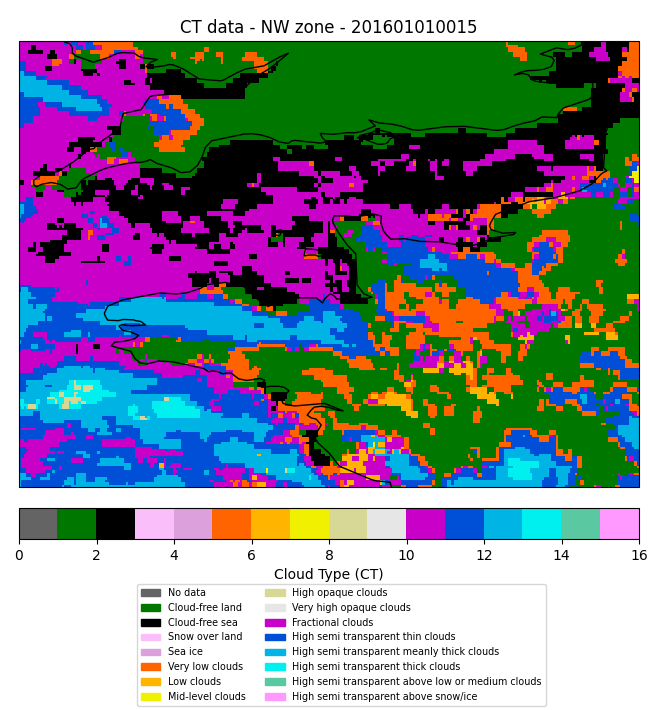
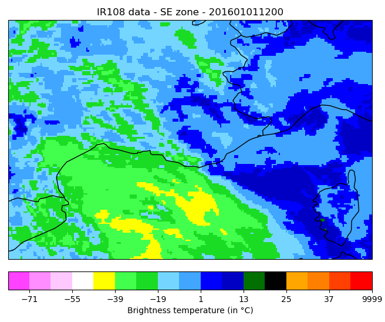
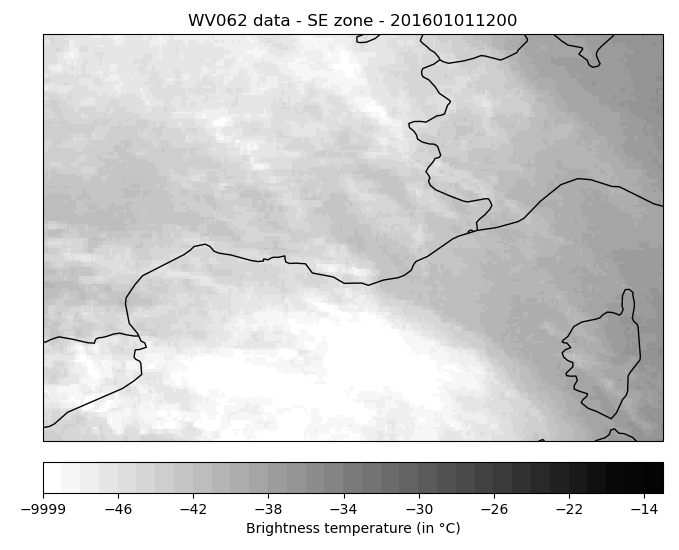

# Satellite data

## Cloud Type (CT) data

### Description

You will find one NetCDF file per geographic zone ('NW' for North-West of France and 'SE' for South-East of France) and per year. 

For each pixel, the value represents a category of cloud type (16 classes in total):

* 0:No data
* 1:Cloud-free land
* 2:Cloud-free sea
* 3:Snow over land
* 4:Sea ice
* 5:Very low clouds
* 6:Low clouds
* ...

The spatial resolution is 0.03° and the time step is 15 minutes but some dates can be missing (due to problems in original data, so we can do anything.

It is about a METEO FRANCE data fusion product. It combines different outputs (satellite imagery, numerical weather prediction parameters..etc) to compute the Cloud Type product. For more information, cf the [official documentation](https://www.nwcsaf.org/Downloads/GEO/2018/Documents/Scientific_Docs/NWC-CDOP3-GEO-MF-CMS-SCI-UM-Cloud_v1.0.pdf) (from page 26).

<<<<<<< HEAD

**Note**: after we put these data online, we learned there is a parallax effect which is not corrected. According to the official documentation (*User Manual of the Parallax Correction Processor of the NWC/GEO*): 
=======
**Note**: after we put these data online, we learned there is a parallax effect which is not corrected. According to the official documentation (*User Manual of the Parallax Correction Processor of the NWC/GEO*): 
>>>>>>> satellite_data

Due to the Geostationary oblique view of features far to the sub-satellite point (ssp), the positions of objects  placed  above  the  surface  are  affected  by  parallax.  As  it  is  shown  in  Figure  1,  a  high  cloud located  on  the  vertical  of  the  site  A  in  the  Earth surface  is  seen  by  a  geostationary  satellite  in  the position of a different site B.

<<<<<<< HEAD

It induces a shift on data (around 3 or 4 pixels on France) against the ground truth. We remarked also some shift between the data and the basemap (due to the used reprojection function). We plan to fix these two aspects for the next version of the dataset. Sorry for the inconvenience. 

=======
>>>>>>> satellite_data
### Files organization

The files are stored by zone and per year:

* NW zone: */data/NW/satellite/CT_NW_"year".nc*
* SE zone: */data/SE/satellite/CT_SE_"year".nc*

## Channels data 

The satellites emit signals at different wavelengths and capture signals reflected and/or re-emitted by the clouds or by the earth surface in clear skies. A channel means a range of wavelenghts : visible, infrared... 

### Visible channel (VIS)

#### Description

You will find one NetCDF file per geographic zone ('NW' for North-West of France and 'SE' for South-East of France) and per year. 

About visible channel, for each pixel, the value represents the radiance (in %), which represents the proportion of radiation reflected by the target (clouds or ground, sea if there are no cloud), in the visible domain. 

The spatial resolution is 0.03° and the time step is 1 hour but some dates can be missing (due to problems in original data, so we can do anything). The missing values are -1.

/!\The visible channel is by definition not visible at night; there are huge gaps of distribution between the day and night.

**What are the use cases and the limitations of the visible channel in meteorology?**

Use cases:

* Detect the clouds more reflecting than the grounds and their scructures (in particular the low clouds);
* Track the clouds and the vegetation;
* Observe the aerosols.
  
Limitations:

* Bad detection of weak reflectivity objects (volcanic ashes, cirrus or cirrostratus clouds);
* Bad detection of non opaque targets, especially if there are below objects with a strong reflectivity (for example, thin cirrus clouds above a snowy ground).

A parallax effect is not corrected into the satellite data in MeteoNet (cf [Note](#note) above for more details).

### Files organization

The files are stored by zone and per year:

* NW zone: */data/NW/satellite/VIS06_NW_"year".nc*
* SE zone: */data/SE/satellite/VIS06_SE_"year".nc*

### Infrared channels (IR)

#### Description

You will find one NetCDF file per geographic zone ('NW' for North-West of France and 'SE' for South-East of France) and per year. 

About infrared channels, for each pixel, the value represents the [ brightness temperature](../../glossary/#brightness_t)  (in °C) of the target (clouds or ground, sea if there are no cloud), in the infrared domain.  

The spatial resolution is 0.03° and the time step is 1 hour but some dates can be missing (due to problems in original data, so we can do anything).

**What are the use cases and the limitations of the infrared channels in meteorology?**

| Channel | Use cases | Limitations | 
| ----------| --------------------- | --------------------- | 
| IR039 (3.92 µm) | Detect fogs and low clouds at night, fires at day. | / |
| IR108 (10.8 µm) | Detect clouds that are colder than the ground. Allows to get an idea about the relative height of cloud tops. Detect cirrus clouds. | The measure can be disturbed if the objects located below the target emit an intense radiation (for example, thin clouds above a very hot land surface). It is sometimes difficult to distinguish low clouds from the ground surface.| 

A parallax effect is not corrected into the satellite data in MeteoNet (cf [Note](#note) above for more details).

### Files organization

The files are stored by channel (IR039 or IR108), zone and per year:

* NW zone, IR039 channel: */data/NW/satellite/IR039_NW_"year".nc*
* SE zone, IR108 channel: */data/SE/satellite/IR108_SE_"year".nc*

### Water vapor channel (WV)

#### Description

You will find one NetCDF file per geographic zone ('NW' for North-West of France and 'SE' for South-East of France) and per year. 

The channel here (6.25 µm) is called "water vapor", because for that wavelength range, the water vapor absorbs a large part of these radiations. It is very useful to know the water vapor content in the atmosphere. That channel is sensitive to high atmospheric layers (above 600hPa) with a stronger sensitivity near to 350hPa. 

For each pixel, the value represents the [ brightness temperature](../../glossary/#brightness_t)  (in °C) of the highest dense layer of water vapor (or cloud). 

The spatial resolution is 0.03° and the time step is 1 hour but some dates can be missing (due to problems in original data, so we can do anything).

The color palette is in black & white:

* In black: in the dry zones where the water vapor concentrates to low atmospheric layers 
* In white: in a very wet atmosphere at high altitude 

**What are the use cases and the limitations of the infrared channels in meteorology?**

Use cases:

* Visualize the water vapor circulation and distribution at high altitude (high [troposphere](../../glossary/#troposphere)). 
* Observe the [tropopause](../../glossary/#tropopause) anomalies ([potential vorticity](../../glossary/#pot-vorticity) maximum in altitude), the vertical movements and sometimes the [jet streams](../../glossary/#jet-stream). 
  
Limitations:

* That measure is very sensitive to temperature, so it can be difficult to analyze in winter on continental areas or in summer on hot areas. 

A parallax effect is not corrected into the satellite data in MeteoNet (cf [Note](#note) above for more details).

### Files organization

The files are stored by zone and per year:

* NW zone: */data/NW/satellite/WV062_NW_"year".nc*
* SE zone: */data/SE/satellite/WV062_SE_"year".nc*
